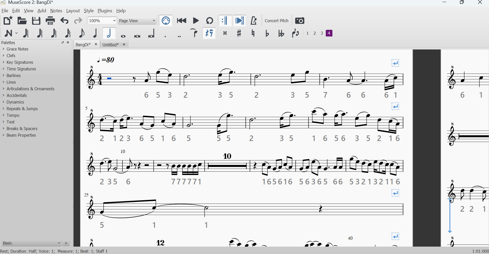
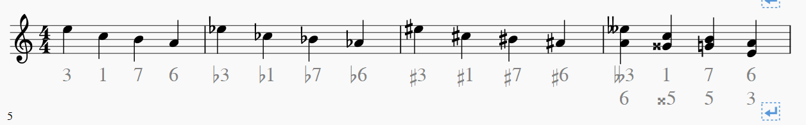

MuseScore 2 plugin for notating scale degrees below staves. Takes up space as "Lyrics".

## Previews

With flats and sharps:

## Who this is for
This is also used as a quick transposition of [MuseScore](https://github.com/musescore/MuseScore) 2 scores for musicians who prefer to read Chinese numbered musical notation 简谱 (which uses scale degrees).

## Usage
- Download and import the `.qml` file ([help](https://handbook.musescore.org/customization/plugins)).
- Run the plugin named "Add Scale Degrees" (see link above for help). It should automatically populate the whole score. It can also be run on a selection rather than the full score.
- You may want to adjust font in `Style > Text... > Lyrics Odd Lines` for better readability. I have no idea how to set styling through the plugin API. A Styles `.mss` is also provided to this repo which you can download.